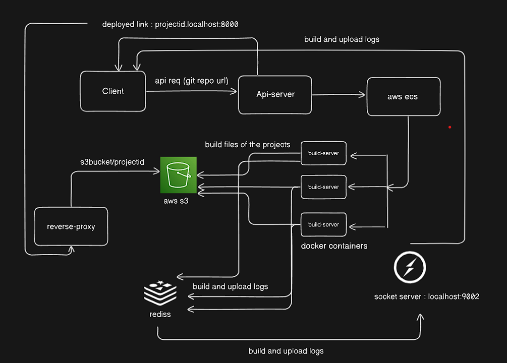

# Webpage Deployment via GitHub URLs

## Introduction
Excited to share my latest project, which streamlines webpage deployment through GitHub URLs with support from AWS, Docker, and more.

## How it Works
- **Api-server:** Initiates the build-server and forwards the git URL and project ID when triggered by a client request.
- **Build-server:** Clones code from GitHub, generates a build folder, and uploads it to the designated S3 bucket.
- **Socket server:** Provides real-time build and update logs from the build-server to clients using Redis.
- **Reverse Proxy:** Routes subdomains and domains to the S3 bucket's static assets.

## Scalability
This architecture ensures scalability through Docker and reverse proxy utilization.

## Technologies Used
- AWS
- Docker
- Redis

## License
This project is licensed under the [Your License] License - see the [LICENSE.md](LICENSE.md) file for details.

